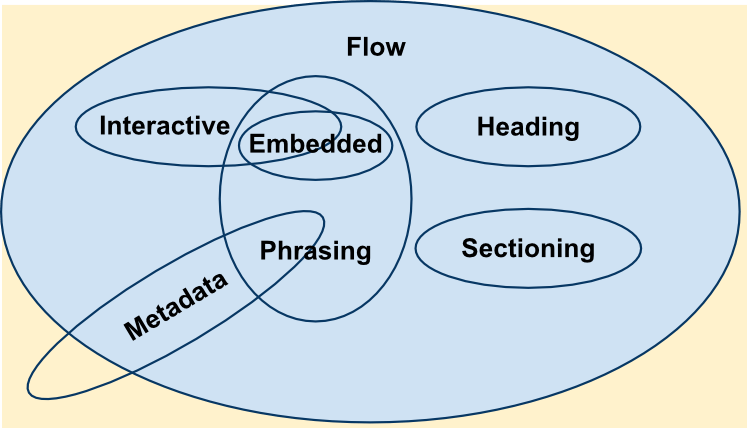

# 内容分类

每一个 HTML 元素都必须遵循定义了它可以包含哪一类内容的规则。这些规则被归类为几个常见的元素**内容模型**（content model）。这是一个松散的分组（它实际上并没有在这些类别的元素之间建立关系），但它们有助于定义和描述这些类别的共同行为及其相关规则，特别是当你遇到它们的复杂细节时。元素也有可能不是这些类别的*任何*成员。

以下是三种类型的内容分类：

- 主内容类，描述了很多元素共享的内容规范；
- 表单相关的内容类，描述了表单相关元素共有的内容规范；
- 特殊内容类，描述了仅仅在某些特殊元素上才需要遵守的内容规范，通常这些元素都有特殊的上下文关系。



### 主内容分类

#### 元数据内容

属于*元数据内容*（Metadata content）的元素可以修改文档其余部分的呈现或行为，建立与其他文档的链接，或者传达其他*外带*信息。

属于这一类的元素有：`<base>、<command> (已弃用)、<link>、<meta>、<noscript>、<script>、<style> 和 <title>`

#### 流式内容

流式内容（Flow content）是一个广泛的类别，包括大多数可以包含在 `<body>` 元素之内的元素，包括标题元素、分段元素、措辞元素、嵌入元素、互动元素和表单相关元素。它还包括文本节点（但不包括那些只由空白字符组成的节点）。

流式元素有：`<a>、<abbr>、<address>、<article>、<aside>、<audio>、<b>、<bdo>、<bdi>、<blockquote>、<br>、<button>、<canvas>、<cite>、<code>、<command> (已弃用)、<data>、<datalist>、<del>、<details>、<dfn>、<div>、<dl>、<em>、<embed>、<fieldset>、<figure>、<footer>、<form>、<h1>、<h2>、<h3>、<h4>、<h5>、<h6>、<header>、<hgroup>、<hr>、<i>、<iframe>、、<input>、<ins>、<kbd>、<label>、<main>、<map>、<mark>、<math>、<menu>、<meter>、<nav>、<noscript>、<object>、<ol>、<output>、<p>、<picture>、<pre>、<progress>、<q>、<ruby>、<s>、<samp>、<script>、<section>、<select>、<small>、<span>、<strong>、<sub>、<sup>、<svg>、<table>、<template>、<textarea>、<time>、<u>、<ul>、<var>、<video>、和 <wbr>`

属于此类的少数其他元素（仅限于某种特殊情形，这些元素才会属于此类）：

- `<area>`，仅限于它作为 `<map>` 的子节点的情形
- `<link>`，仅限于 [itemprop](https://developer.mozilla.org/zh-CN/docs/Web/HTML/Global_attributes/itemprop) 属性存在的情形
- `<meta>`，仅限于 [itemprop](https://developer.mozilla.org/zh-CN/docs/Web/HTML/Global_attributes/itemprop) 属性存在的情形
- `<style>`，仅限于 `scoped` (已弃用) 属性存在的情形

#### 分段内容

分段内容（Sectioning content）是流式内容的一个子集，可以在任何可以使用流式内容的地方出现。属于分段内容模型的元素创建了一个*当前大纲中的分段*，它定义了 `<header>` 元素、`<footer>` 元素和[标题内容](#标题内容)的范围。

属于此类的元素有：`<article>、<aside>、<nav> 和 <section>`

#### 标题内容

标题内容（Heading content）是流式内容的一个子集，定义了分段的标题，而这个分段可能由一个明确的[分段内容](#分段内容)元素直接标记，也可能由标题本身隐式地定义。标题内容可以在任何可以使用流式内容的地方出现。

属于此分类的元素有：`<h1>~<h6>、<hgroup>`。

> **备注：** 尽管 `<header>` 可能包含一些标题内容，但其并不是标题内容本身。

> **备注：** `<hgroup>` 元素已不再推荐使用，因为它不能与辅助性技术正常配合工作。在 HTML 5 定稿之前，它已从 W3C 的 HTML 规范中删除，但仍是 WHATWG 规范的一部分，并且至少被大多数浏览器部分支持。

#### 短语内容

短语内容（Phrasing content）是流式内容的一个子集，定义了文本和它包含的标记，且可以在任何可以使用流式内容的地方出现。一些短语内容就构成了段落。

属于此类的元素有：`<abbr>、<audio>、<b>、<bdo>、<br>、<button>、<canvas>、<cite>、<code>、<command> (已弃用)、<datalist>、<dfn>、<em>、<embed>、<i>、<iframe>、、<input>、<kbd>、<label>、<mark>、<math>、<meter>、<noscript>、<object>、<output>、<progress>、<q>、<ruby>、<samp>、<script>、<select>、<small>、<span>、<strong>、<sub>、<sup>、<svg>、<textarea>、<time>、<var>、<video>、<wbr> 和纯文本（仅当所包含的内容不完全为空字符）`

一些其他的元素也属于这个分类，但是只有当如下特殊情况时才会实现：

- `<a>`，当它仅包含短语内容时
- `<area>`，当它为 `<map>` 元素的子元素时
- `<del>`，当它仅包含短语内容时
- `<ins>`，当它仅包含短语内容时
- `<link>`，仅限于 [itemprop](https://developer.mozilla.org/zh-CN/docs/Web/HTML/Global_attributes/itemprop) 属性存在的情形
- `<map>`，当它仅包含短语内容时
- `<meta>`，仅限于[itemprop](https://developer.mozilla.org/zh-CN/docs/Web/HTML/Global_attributes/itemprop) 属性存在的情形

#### 嵌入内容

嵌入内容（Embedded content）是流式内容的一个子集，它将来自另一种标记语言或命名空间的内容插入到文档中，且可以在任何可以使用流式内容的地方出现。属于此类的元素有：`<audio>、<canvas>、<embed>、<iframe>、、<math>、<object>、<picture>、<svg> 和 <video>`

#### 交互内容

交互式内容（Interactive content）是流式内容的一个子集，包含为用户交互而特别设计的元素，且可以在任何可以使用流式内容的地方出现。属于此类的元素有：`<a>、<button>、<details>、<embed>、<iframe>、<label>、<select> 和 <textarea>`。

仅在特殊情形下才会属于此类的元素有：

- `<audio>`，若 [`controls`](https://developer.mozilla.org/zh-CN/docs/Web/HTML/Element/audio#controls) 属性存在
- ``，若 [`usemap`](https://developer.mozilla.org/zh-CN/docs/Web/HTML/Element/img#usemap) 属性存在
- `<input>`，若 [type](https://developer.mozilla.org/zh-CN/docs/Web/HTML/Element/input#type) 属性不处于隐藏（hidden）状态
- `<object>`，若 [`usemap`](https://developer.mozilla.org/zh-CN/docs/Web/HTML/Element/img#usemap)属性存在
- `<video>`，若 [`controls`](https://developer.mozilla.org/zh-CN/docs/Web/HTML/Element/video#controls) 属性存在

#### 可感知内容

当内容既不是空的也不是隐藏的时候，它就是可感知（palpable）的；它是被渲染的内容，是实质性的。模型为流动内容的元素应该至少有一个节点是可感知的。

#### 表单相关内容

与表单相关的内容（Form-associated content）是流程内容的一个子集，包括有表单所有者的元素，通过 **form** 属性暴露出来，可以在预期有流式内容的地方使用。表单所有者要么是包含 `<form>`的元素，要么是在 **form** 属性中指定其 id 的元素。

```
<button>
<fieldset>
<input>
<label>
<meter>
<object>
<output>
<progress>
<select>
<textarea>
```

此类包含了几个子类：

```
可列举的元素（listed）
在 form.elements 和 fieldset.elements IDL collection 中列举出的元素。包括 <button>、<fieldset>、<input>、<object>、<output>、<select> 和 <textarea>。

可标记的元素（labelable）
和 <label> 相关联的元素。包括 <button>、<input>、<meter>、<output>、<progress>、<select> 和 <textarea>。

可提交的元素（submittable）
包括当表单提交时可以用来组成表单数据的元素。包括 <button>、<input>、<object>、<select> 和 <textarea>。

可重置的元素（resettable）
当表单重置时会被重置的元素。包括 <input>、<output>、<select> 和 <textarea>。
```

### 二级分类

这里还有一些你需要注意的二级分类元素。

#### 支持脚本元素

**支持脚本的元素**（Script-supporting elements）不会直接渲染输出在页面文档中。相反，它们的作用是支持脚本，或者直接包含或指定脚本代码，或者指定将被脚本使用的数据。

这些支持脚本的元素有：

- `<script>`
- `<template>`

### 透明内容模型

如果一个元素拥有透明内容模型（Transparent content model），即使将透明内容移除并使用子元素取代，其内容也必须由合法的 HTML5 元素组成。

例如，`<del>` 和 `<ins>` 是透明的：

```html
<p>
  We hold these truths to be <del><em>sacred &amp; undeniable</em></del>
  <ins>self-evident</ins>.
</p>
```

即使这两个元素被移除，这个代码段依然是合法的（至少从代码语法上）。

```html
<p>We hold these truths to be <em>sacred &amp; undeniable</em> self-evident.</p>
```
